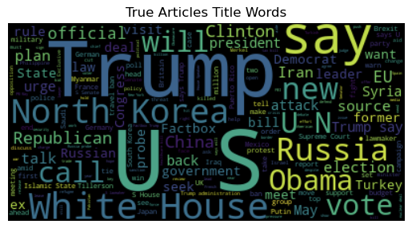
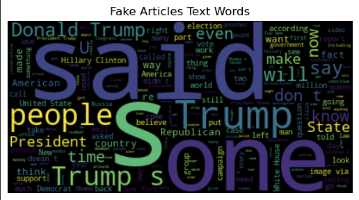
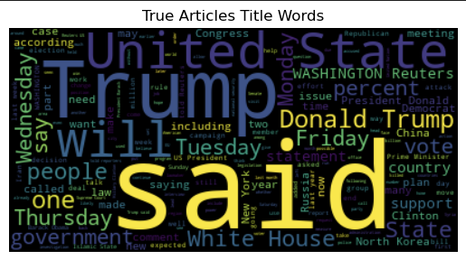

# Fake Real News Detection

## About

This project implements a machine learning solution to classify news articles as real or fake using Naive Bayes classification techniques. With the increasing prevalence of misinformation in digital media, this tool aims to help identify potentially false news articles through statistical analysis.








## Getting Started

### Clone the Repository

```bash
git clone https://github.com/Vin-dictive/fake-real-news-detection
cd fake-real-news-detection
```

**Note:** The initial clone may take some time as the repository contains dataset files (CSV files in the `data/` directory).

## Packages and Dependencies

### Core Dependencies

- **Python 3.13** - Programming language
- **NumPy** - Numerical computing library
- **Pandas** - Data manipulation and analysis
- **Scikit-learn** - Machine learning library
- **SciPy** - Scientific computing library

#### Visualization & Analysis

- **Matplotlib** - Plotting library
- **Altair** - Statistical visualization library
- **WordCloud** - Word cloud generation

#### Development Environment

- **Jupyter** - Interactive notebook environment

### Environment Setup

#### Option 1: If you have conda-lock installed, use conda-lock (Recommended)

1. Install from lock file for your platform:

   ```bash
   conda-lock install --name fake-news-detection <your os>.lock
   conda activate fake-news-detection
   ```

#### Option 2: Using environment.yml

1. Create conda environment:

   ```bash
   conda env create -f environment.yml
   conda activate fake-news-detection
   ```

#### Option 3: Using Docker

1. Build and run with Docker Compose:

   ```bash
   docker-compose up --build
   ```

2. Access Jupyter Lab at <http://localhost:8000>

## Usage

1. After setting up the environment, launch Jupyter notebook:

   ```bash
   jupyter notebook
   ```

2. Navigate to `notebooks/analysis.ipynb`
3. The analysis notebook can be run from scratch using the restart button in Jupyter
4. All cells can be executed sequentially for complete analysis

## Dataset Information

This project uses a news classification dataset containing:

- **True.csv**: Contains real news articles
- **False.csv**: Contains fake news articles

### Dataset Details

- **Source**: <https://www.kaggle.com/datasets/clmentbisaillon/fake-and-real-news-dataset>
- **Size**: 116.37 MB

*Note: Please refer to the original dataset documentation for detailed information about data collection methodology and licensing terms.*

## Repository Structure

```
fake-real-news-detection/
├── data/
│   ├── Fake.csv              # Fake news articles dataset
│   └── True.csv              # Real news articles dataset
├── img/
│   ├── readme_1.png              
│   └── readme_2.png
│   ├── readme_3.png              
│   └── readme_4.png
├── notebooks/
│   └── analysis.ipynb        # Main analysis and modeling notebook
├── CODE_OF_CONDUCT.md
├── conda-lock.yml
├── CONTRIBUTING.md
├── environment.yml
├── LICENSE
├── README.md
```

## Contributors

### Jessie Liang

- **Affiliation**: University of British Columbia
- **Email**: <rnliang.jessie@gmail.com>
- **GitHub**: [@jessie-liang](https://github.com/jessie-liang)

### Sarah Gauthier

- **Affiliation**: University of British Columbia
- **Email**: <sgauth01@student.ubc.ca>
- **GitHub**: [@sgauth01](https://github.com/sgauth01)

### Vinay Valson

- **Affiliation**: University of British Columbia
- **Email**: <vinay.valson@gmail.com>
- **GitHub**: [@Vin-dictive](https://github.com/Vin-dictive)

## Contributing

We welcome contributions to this project! Please see our [Contributing Guidelines](CONTRIBUTING.md) for details on how to get started.

Please read our [Code of Conduct](CODE_OF_CONDUCT.md) before contributing.

## License

This project is licensed under the terms specified in the [LICENSE](LICENSE) file.
