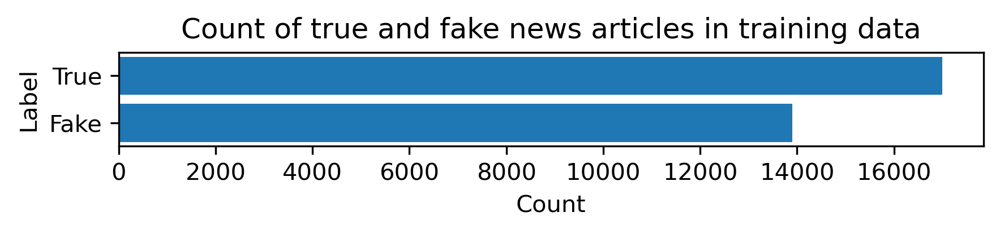
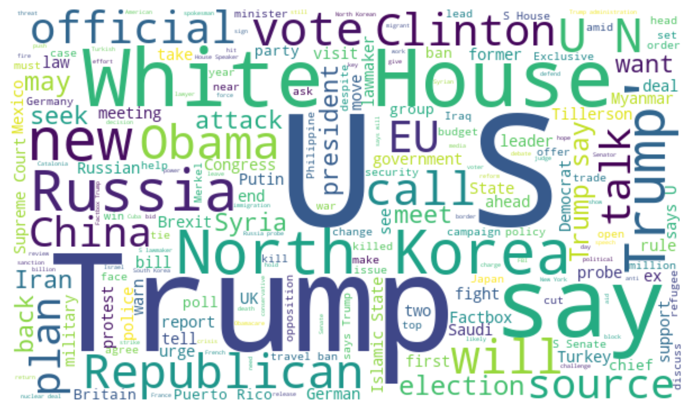
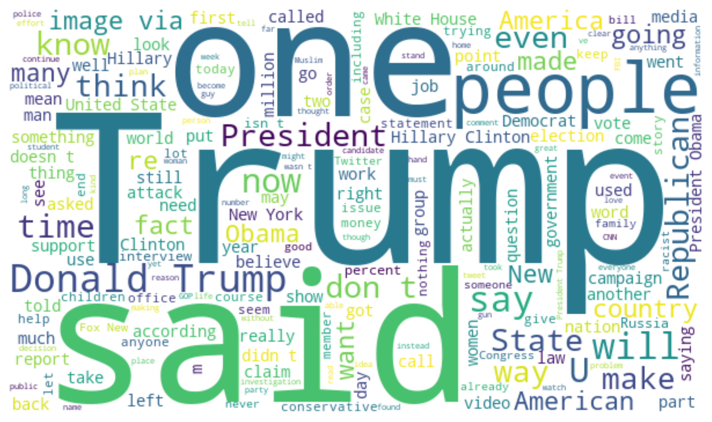
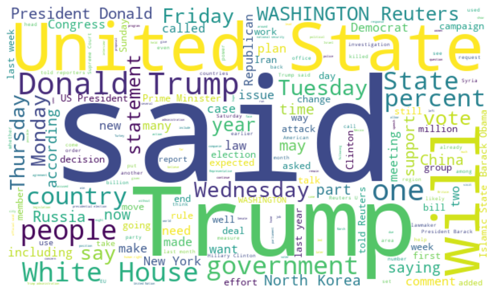
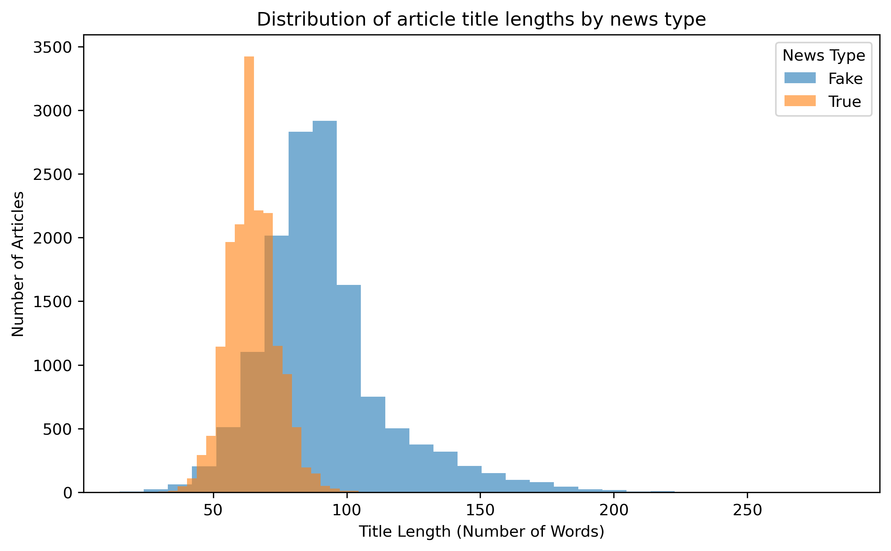
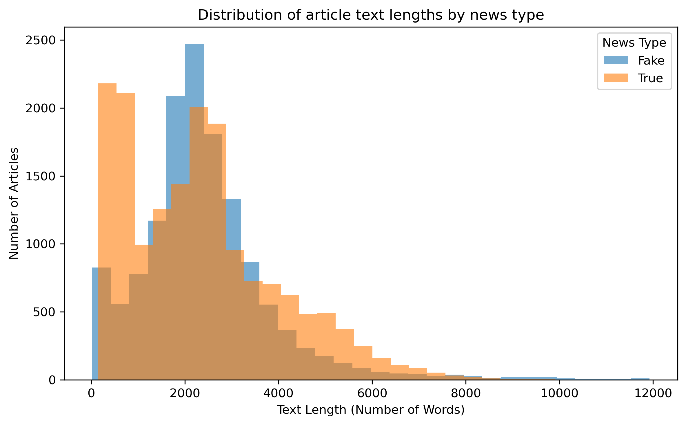
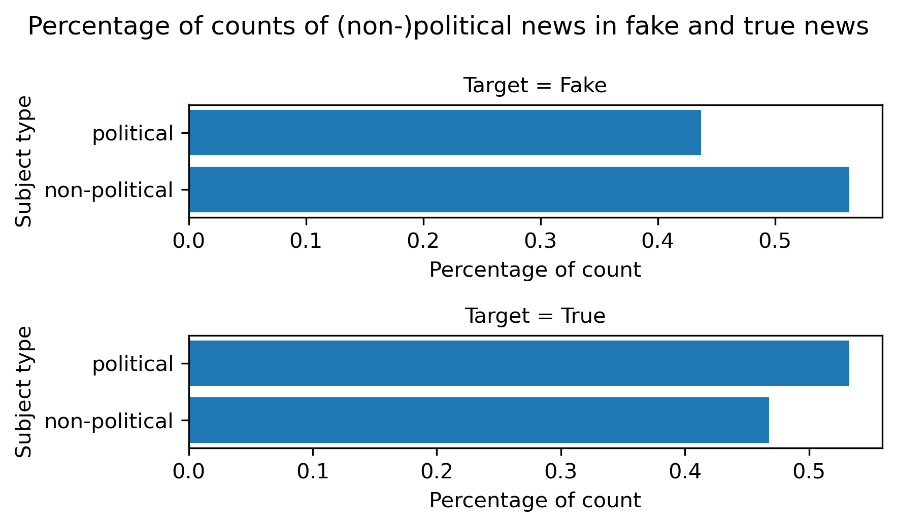

**Note**: The model fitting code runs up to 5 minutes.

```{python}
#| echo: false
import numpy as np
import pandas as pd
from sklearn.metrics import ConfusionMatrixDisplay, PrecisionRecallDisplay, RocCurveDisplay, classification_report,average_precision_score, roc_auc_score
import pickle
```

# Summary

News is everywhere. In this digital era, there exists both true and fake news on the Internet, making it harder for readers and news agents to differentiate them. This makes fake news detection a technology with rising demands to help defend information integrity. To solve this problem, applied machine learning is used for binary classification. The fitted Naive Bayes model with `MultinomialNB` as estimator and `title`, `text` and `subject` as features yields a test classification accuracy of 0.954, where the false positive and false negative rates are both low. The AP score and AUC value of the final model end up being 0.97 and 0.98 respectively, suggesting decent and satisfactory performance. Compared to the baseline dummy classifier, this Naive Bayes model classifies both true and fake news significantly better, which is reflected by consistently high and similar training, cross-validation and test scores. This machine learning model gives us confidence in its performance, which points to its potential to be deployed and used in the real world. Despite this, it does have limitations since the training data does not cover all possible types of news. When deployed in the wild, the model might perform badly in news of other realms, such as entertainment news. If more comprehensive data can be collected, then this model might handle various cases more accurately.

# Introduction

"Fake news", also known as disinformation, is deliberately misleading or false information presented as legitimate news [@servicecanada2024]. Its rapid spread in recent years has become a pressing concern, particularly with the rise of social media platforms that accelerate the dissemination of content. These platforms are designed with the primary objective of capturing and retaining user attention for as long as possible [@pen]. To that end, fake news often exploits this design to gain traction.

There is high public awareness of this issue in Canada. In 2023, Statistics Canada reported that 59% of Canadians admitted that they were "very or extremely concerned about online misinformation" in the Survey Series on People and their Communities [@bilodeau2024]. In the United States, the concept of "fake news" grew in popularity during the 2016 presidential election. @allcott2017 estimated that false news stories were shared on Facebook at least 38 million times in the 3 months leading up to the election. Such widespread circulation of this false information can have serious consequences, including influencing public opinion and undermining trust in legitimate news sources. Thus, methods for detecting fake news may be beneficial in mitigating its spread.

This report investigates whether a machine learning model can accurately classify news articles as "fake" or "true" based on their textual characteristics, such as the article's title, subject and body content. Automated detection of fake news has the potential to mitigate the spread and impact of information, particularly in social media's fast-paced environment where information is shared instantly and at scale, from numerous sources.

# Data

The dataset used in this analysis is the "Fake and Real News Dataset" available on Kaggle [@bisaillon2023]. It contains approximately 40,000 news articles published in the United States between 2015 and 2018. Each row in the dataset represents a news article, with a column for its title, subject, date, and body text.

## Data Cleaning and Transforming

The raw data from Kaggle was initially provided as two seperate datasets: one for the fake articles and one for the true articles. To prepare the data for modeling, we conducted some validation checks to make sure the data was in the expected format, with no missing observations or duplicate entries. We then cleaned and standardized the data before combining the true and fake datasets into one complete dataset. A new target column was added to label each article as either True or Fake, and the subject column values were simplified into consistent categories (political vs. non‑political) so that the merged dataset has consistent features ready for analysis.

To support model training and evaluation, we shuffled the rows and split the data into training (80%) and testing (20%) sets. Further validation was conducted on the training set to identify any outliers and anomoulous correlations. Finally, we conducted exploratory data analysis (EDA) on the training data set to examine the distribution of the target variable and gain initial insights into the dataset.

# Methods

## Exploratory Data Analysis (EDA)

```{python}
#| echo: false
train_df = pd.read_csv("../data/processed/train_data.csv")

fake_count = int(train_df['target'].value_counts()['Fake'])
true_count = int(train_df['target'].value_counts()['True'])
```

To begin our exploratory analysis of the training data, we generated a concise summary of the data, to show the non-null value counts and data types for each feature in the training dataset. This was done using the Pandas `.info()` method.

```{python}
#| echo: false
#| label: fig-train-info
#| fig-cap: "Summarised information on training data set"
train_df.info()
```

From @fig-train-info, we see that the training data contains `{python} len(train_df)` observations. Each observation represents a news article with a title, text, subject, date and target label. Notably, we also see that there are no missing values in our training data set which means we can proceed without any imputation or row removal. 

### Count of Fake vs. Real News Articles

To better understand the balance of the target classes, we plotted the counts of articles labeled as `True` and `Fake` in the training dataset.

{#fig-fake-real-count width=70%}

From @fig-fake-real-count, we can see that the training dataset is fairly balanced, with `{python} fake_count` fake news articles and `{python} true_count` real news articles. This balance may help to prevent bias towards one class over the other when training our model and increases the likelihood that it will learn to distinguish between fake and real news effectively.

### Word Clouds for Title Column

Beyond class counts, it is useful to explore the language patterns in the dataset. Word clouds provide a quick visual summary of the most frequent words appearing in article titles. By comparing words appearing in fake and real news titles, we can identify differences in vocabulary, tone, or emphasis that may help models learn discriminative features.

Before generating the word clouds, we cleaned the text by removing punctuation and possessive contractions (e.g., 's). This ensures that the visualization highlights more meaningful words.

{#fig-fake-wordcloud width=60%}

{#fig-true-wordcloud width=60%}

### Word Clouds for Text Column

The most prominent words in the fake news titles include "VIDEO", "Trump" and "Obama". The most common words in the true news titles include "Trump", "US" and "White House".

We can see that "Trump" appears frequently in both fake and true news titles, which means that it may not give much discriminatory power when classifying articles. However, words like "VIDEO", that appear much more frequently in fake news titles, may help the model identify fake news articles.

{#fig-fake-text-wordcloud width=60%}

{#fig-true-text-wordcloud width=60%}

The most commonly used words in the body text of fake news articles include "Trump", "said", and "one". The most frequent words in true news articles are "Trump", "said", and "United State". Given that there is more overlap in the common words used in the body text of fake and true news articles compared to the titles, the titles may provide more distinctive features for classification.

### Comparing Title and Text Length between Fake and Real News Articles

Another important aspect of exploratory analysis is to examine whether simple structural features of the articles — such as the length of titles and body text — differ between fake and real news. To do this, we generated histograms that show the distribution of article title lengths and article text lengths for fake and true news.

{#fig-length-distributions width=75%}

{#fig-text-length-distributions width=75%}

From @fig-length-distributions, we can see that the length of true news titles appears to have bell-shaped distribution, while the length of fake news titles is right-skewed. This suggests that if the title of a news article is particularly long, it may be more likely to be fake news. This strategy may be utilized to grab readers' attention with sensational or clickbait-style headlines.

When comparing the body text lengths in @fig-text-length-distributions, we can see that both fake and true news articles have right-skewed distributions. Their distributions are quite similar, indicating that body text length may not be a strong indicator of whether an article is fake or true news.

### Comparing the Percentage of Counts of Subjects between Fake and Real News Articles

Another feature of our dataset is the subject of the news article. Here, we examine whether the suject matter of articles differs between fake and real news. In our dataset, each article is labeled as either *political* or *non‑political*. To compare distributions fairly, we calculated the percentage of articles in each subject category within the fake and true subsets of the training data and plotted the results.

{#fig-subject-counts width=75%}

As shown in @fig-subject-counts, non-political news accounts for a larger portion of the fake news, while there is a larger percentage of political news in the true news. The difference of percentages exists but is not conspicuous, suggesting this engineered feature `subject` may still be useful in predicting whether news is true. Therefore, the feature `subject` (political vs non-political) is included in the classification model below.

## Classfication Modeling Analysis

## Dummy Classifier

Before evaluation our model, it is important to establish a baseline for comparison. The Dummy classifier acts as this baseline by applying a simple strategy to classify observations rather than learn from the data. In this case, our Dummy classifier always predicts the majority class, using the "most_frequent" strategy. The goal later on is to build a classification model that does well compared to this Dummy.

## Naive Bayes Classifier

`MultinomialNB` is used as the estimator to deal with integer counts data, after proper preprocessing of the features. Two textual features (`title` and `text`) and a categorical feature `subject` with only two levels (*political* and *non-political*) are included in modelling. The `date` feature is dropped due to its irrelevance to the target. Genereally speaking, when the news is published is random information and has little to do with whether the news is fake or true.

As a first step, the features should be preprocessed. One-Hot encoding is applied to the categorical feature `subject` with `drop="if_binary"` to include only one column for this binary feature. For the two textual features, `title` and `text`, they are first transformed by `lambda x: np.ravel(x)` to be one-dimensional arrays. After being flattened, they are then passed to `CountVectorizer` to extract the words and number of occurrences from these two features. Note that `CountVectorizer` needs to be created twice, one for each textual feature.

Next, a machine learning pipeline `pipe` is created, with preprocessing and the Naive Bayes estimator.

Before fitting the model to the training set, hyperparameter tuning is carried out to boost classification performance. There are 3 hyperparameters being considered: `max_feautres` of the two `CountVectorizer`s, and `alpha` of `MultinomialNB`. The distributions of these hyperparameters to search from are specified below, followed by `RandomizedSearchCV` to do random search and cross validation. 

Note that `RandomizedSearchCV` runs very slowly in this case. To reduce computation time, `n_iter` is set to only 10. Albeit doing only 10 searches, the best model found already performs very well, as we can see from the CV score and test scores below.

# Results

As a baseline, dummy classifier is first fitted to get the test accuracy.

```{python}
#| echo: false
X_train = pd.read_csv("../data/processed/X_train.csv")
y_train = pd.read_csv("../data/processed/y_train.csv")
X_test = pd.read_csv("../data/processed/X_test.csv")
y_test = pd.read_csv("../data/processed/y_test.csv")

with open("../models/dummy_clf.pkl", "rb") as f:
    dummy_clf = pickle.load(f)
dummy_pred = dummy_clf.predict(X_test)
dummy_accuracy = dummy_clf.score(X_test, y_test)
```

Using most frequent dummy classifier, the test score is low (only `{python} f"{dummy_accuracy:.3f}"`) due to a relatively balanced dataset. Now compare the Naive Bayes model with the dummy classifier. 

```{python}
#| echo: false
def ravel_transform(x):
    return np.ravel(x)

with open("../models/naive_bayes.pkl", "rb") as f:
    nb_model = pickle.load(f)
train_score = nb_model.score(X_train, y_train)
best_cv_score = nb_model.best_score_
test_score = nb_model.score(X_test, y_test)
```

After fitting the Naive Bayes model to the training set, the best hyperparameters and CV score can be extracted from the model. The best values of all 3 hyperparameters are in the middle of the search ranges instead of being on the edge, so the search ranges are specified appropriately. Under this model, the training score is `{python} f"{train_score:.3f}"`. The best CV score is `{python} f"{best_cv_score:.3f}"`, and the test score is `{python} f"{test_score:.3f}"`. Since the train, CV and test score are close to one another and are both high, underfitting or overfitting is not a concern here. Compared to dummy classifier, this Naive Bayes model performs a lot better in terms of prediction accuracy, increasing the test score from `{python} f"{dummy_accuracy:.3f}"` to `{python} f"{test_score:.3f}"`.

The Naive Bayes model demonstrates strong performance in distinguishing between fake and real news articles based on their textual characteristics, as shown in the word clouds (@fig-fake-wordcloud and @fig-true-wordcloud) which reveal distinct vocabulary patterns between fake and real news.

## Model Evaluation

Below are the visualizations of the classification results on the test set, as a model performance assessment.

```{python}
#| echo: false
#| label: fig-confusion-matrix
#| fig-cap: Confusion matrix for Naive Bayes classifier on test set

ConfusionMatrixDisplay.from_estimator(
    nb_model,
    X_test,
    y_test,
    values_format="d"
)
```

```{python}
#| echo: false

print(
    classification_report(
        y_test, nb_model.predict(X_test)
    )
)
```

The model classifies both true and fake news correctly most of the time, indicated by a high true postive and true negative rate. Both false positve and false negative rates are low, since there are few misclassifications. Therefore, not only is the model accuracy high, but the model is also robust in correctly detecting both true and fake news, with few misclassifications.

```{python}
#| echo: false
#| label: fig-pr-curve
#| fig-cap: Precision-Recall curve for Naive Bayes classifier on test set

PrecisionRecallDisplay.from_estimator(
    nb_model,
    X_test,
    y_test,
    pos_label='Fake',
    name='MultinomialNB'
)

prob_scores = nb_model.predict_proba(X_test)[:, 1]
ap_score = average_precision_score(y_test, prob_scores, pos_label='True')
```

The AP score, as a summary of the PR curve, is `{python} f"{ap_score:.2f}"`. That fact that the AP score is very close to 1 suggests that our Naive Bayes model's performance is excellent.

```{python}
#| echo: false
#| label: fig-roc-curve
#| fig-cap: ROC Curve for Naive Bayes classifier on test set

RocCurveDisplay.from_estimator(
    nb_model,
    X_test,
    y_test,
    pos_label='Fake'
)

prob_scores = nb_model.predict_proba(X_test)[:, 1]
auc_value = roc_auc_score(y_test, prob_scores)
```

The AUC here is `{python} f"{auc_value:.2f}"`, which is much higher than the baseline 0.5, further indicating the satisfactory performance of the Naive Bayes model.

# Discussion

## Results Summary

The Naive Bayes model performs decently well due to high accuracy, high true positive rate, high true negative rate, low false postive rate, low false negative rate, high AP score and high AUC value. Apart from these exceptional evaluation metrics, this model also does not throw major concerns such as underfitting or overfitting problems. The training score (`{python} f"{train_score:.3f}"`), the best CV score (`{python} f"{best_cv_score:.3f}"`), and test score (`{python} f"{test_score:.3f}"`) are consistently high and close to one another, so there is no noticeable underfitting or overfitting issue. To summarize, compared to the baseline model (dummy classifier), this Naive Bayes model exhibits major improvements, returning satisfactory results.

Our findings are partly aligned with expectations. According to the nature of political news, it is expected that there is more political news under the fake news category. However, in this dataset, there is only 2% more political news in fake news compared to true news. This marginal difference is not expected. 

Despite this, the Naive Bayes model generally yields high performance, even if it is simple. So, using `MultinomialNB` with hyperparameter tuning gives an expected high prediction performance. Moreover, the original counts of words are used instead of the binary information presence/absence, so there is no loss of information in modelling. Therefore, the satisfactory result is as expected.

## Impact of these Findings

This Naive Bayes model could potentially be deployed and used for news classification, which may help news readers identify fake news and avoid accepting false information. Secondly, this news classification model could also assist news agents screen and select only the true news to publish, avoiding losing reputation for articulating fake news. Lastly, this model could inspire further improvements of news classification models, acting as a good starting point for future model building.

Specific to this particular model, two future questions could be asked. First, the percentage of counts of political news is only marginally different between true and fake news. So, it is worth exploring whether dropping the `subject` feature will increase or decrease the model performance. This can be done by comparing the two models with and without the `subject` feature. Second, what other possible features can be used or engineered to further improve the model performance? This can be explored by asking for suggestions from human experts with domain knowledge. So far only the Naive Bayes model is used, which is a simple and naive model. Not restricted to this model anymore, there are other questions that can be raised. For example, are there any other more advanced models that can deal with integer count data and have more satisfying results?

## Limitations of Analysis

All news are classified as political and non-political in the analysis, which is crude and leaves space for improvement. More detailed `subject` categories can be applied to improve model performance. Besides that, all the collected data we have do not cover all types of news in the world. The topics included in the dataset are rather quite limited. So, this model could do well when seeing similar news, but could fail when given a totally unfamiliar news topic. So enriching the training data is essential to deploy the model in the wild.

# Conclusion

The machine learning approach using Naive Bayes classification shows promising results for fake news detection. The model's high accuracy and balanced performance across both classes suggest it could be a valuable tool in combating misinformation. However, the model's performance may be limited to the types of news articles present in the training data, and further validation on diverse news sources would be beneficial for real-world deployment.

# References